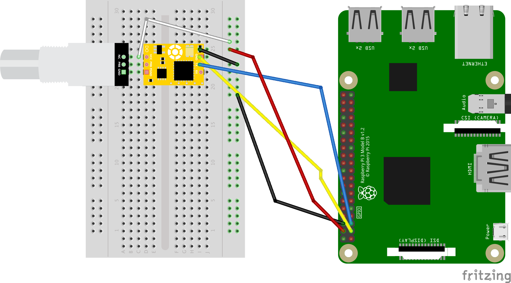
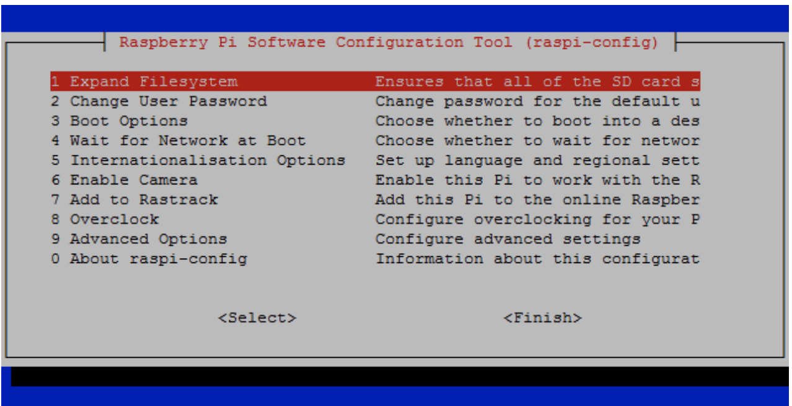
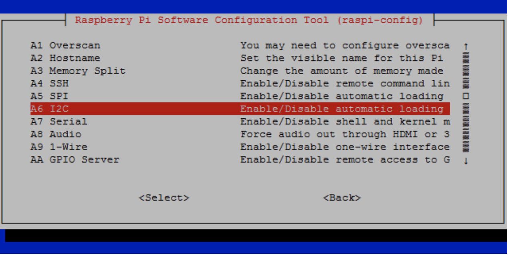
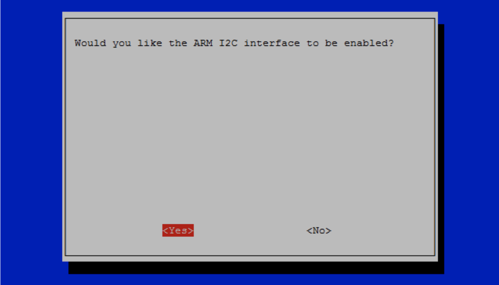

# DiO Controllers

This project uses a [Raspberry Pi 3](https://www.raspberrypi.org/products/raspberry-pi-3-model-b/) to send sensor data from an [Atlas Scientific Dissolved Oxygen sensor](https://www.atlas-scientific.com/product_pages/kits/do_kit.html) to a remote server. The controller code is written in Python. This setup assumes that you can setup your Raspberry Pi and that you have a basic knowledge of the command line. If you are having trouble checkout [the Wiki](https://github.com/osu-cascades/dio-controllers/wiki) for step-by-step instructions to get your setup running.

## Getting Started

These instructions will help you get the sensor controller and sensor up and running. See [dio-service](https://github.com/osu-cascades/dio-service) to get the service running, and [dio-web](https://github.com/osu-cascades/dio-web) to get the web application running.

### Prerequisites

Hardware you will need:

- [Raspberry Pi 3](https://www.raspberrypi.org/products/raspberry-pi-3-model-b/)
- At least 8GB [Micro SD card](https://www.amazon.com/s/ref=nb_sb_noss_2?url=search-alias%3Delectronics&field-keywords=micro+sd&rh=n%3A172282%2Ck%3Amicro+sd&ajr=0)
- [Micro USB power supply (2.1 A)](https://www.amazon.com/Raspberry-Keten-Charger-Adapter-Android/dp/B01K7EF2XS/ref=sr_1_cc_2?s=aps&ie=UTF8&qid=1510630813&sr=1-2-catcorr&keywords=micro+usb+power+cable)
- Monitor and HDMI cable (only needed to setup)
- Keyboard and mouse (only needed to setup)
- Atlas Scientific [Dissolved Oxygen sensor kit](https://www.atlas-scientific.com/product_pages/kits/do_kit.html)
- [Jumper wires (female-to-male & male-to-male)](https://www.amazon.com/s/ref=nb_sb_noss_2?url=search-alias%3Dmobile&field-keywords=female+to+male+jumper+wires)
- [USB Wifi adapter](https://www.amazon.com/Edimax-EW-7811Un-150Mbps-Raspberry-Supports/dp/B003MTTJOY)
- [Breadboard](https://www.amazon.com/s/ref=nb_sb_noss_2?url=search-alias%3Delectronics&field-keywords=breadboard&rh=n%3A172282%2Ck%3Abreadboard)

## Hardware Setup

### Wiring Up the Sensor(s)


## Software Setup

Flash the latest version of [Raspbian](https://www.raspberrypi.org/downloads/) onto the micro SD card and get your Pi set up by following the [documentation](https://www.raspberrypi.org/help/). (This will take about 30 minutes to download and install, so this would be a good point to get up and get some coffee :coffee: ). Note that these instructions did not use NOOBS, but used the _Raspbian Stretch Desktop_, directly imaged to the micro SD card.

Start the Raspberry Pi to ensure that it boots.

Update the Wi-Fi settings and ensure that the date and time are correct.

### Using NOOBS?

If you installed Raspbian by flashing the full image to the SD card, skip this step.

If you are installing the OS with NOOBS, you may need to expand the filesystem. Run the following command line within the Raspberry Pi’s terminal.

```
sudo raspi-config
```

You should see a blue screen with options in a gray box in the center, like so, choose expand file system




### Install the Dependencies

Run the following commands in the terminal to update apt-get, upgrade installed packages, and install the project dependencies.

```
sudo apt-get update
sudo apt-get upgrade
sudo apt-get install git-core
sudo apt-get install python-dev
sudo apt-get install python-serial
sudo apt-get install python-rpi.gpio
```

### Enabling Serial Port

By default, the serial port on the Raspberry Pi is disabled, so you will need to manually enable it.
To do so, run _raspi-config_:

```
sudo raspi-config
```

Select _Advanced Options_.


Then select _Serial_.


Select _Yes_.


Select _Ok_.


Reboot your Pi.


The serial port is now ready to be hooked up!

### Download Sample Code
To download the Atlas Scientific™ sample code,run the following commands within the
Raspberry Pi’s terminal.
```
cd ~
git clone https://github.com/AtlasScientific/Raspberry-Pi-sample-code.git
```
Once the sample code has finished downloading, you will be almost ready to begin
using the Atlas Scientific™ EZO™ class circuits with your updated Raspberry Pi.

### Enable I2C Mode

There are three communication modes that the Atlas Scientific can operate in with the RP3: USB mode, UART mode, and I2C. For this setup we used I2C mode and you must first enable the I2C channel on your RP3. For more information about the different modes reference the Atlas Scientific [Sensor Documentation](https://www.atlas-scientific.com/_files/code/pi_sample_code.pdf).

Before you enable the I2C Bus you need to install some packages

```
$ sudo apt-get install python-smbus
$ sudo apt-get install i2c-tools
```
Once those packages have finished installing, you need to re-open the Raspberry Pi config

```
$ sudo raspi-config
```
Go to Advanced options


Select I2C




Select Yes




Select Ok and reboot the raspberry Pi once again.

```
$ sudo Reboot
```

### Test Sensor Connection

To ensure the sensor is properly connected to your raspberry pi's I2C Bus, run the following command

```
$ sudo i2cdetect -y 1
```

This will report information about each connected I2C device and should display that I2C address (0x61) is in use.
Depending on the sensor you are using you will see a different I2C address in use. The pH sensor for example lists (0x63) as its I2C address, refer to the [documentation](https://www.atlas-scientific.com/_files/code/pi_sample_code.pdf) for your sensors specific address. Also note that the documentation lists the address in decimal format, so the pH sensors address is listed as "93" which translates to (0x63) in hexadecimal.

Once you see your devices listed in the I2C bus, you are ready to test communication with the sensor.

After you have downloaded the sample code, open the terminal in the directory and run

```
$ sudo python i2c.py
```

If you are not using i2C Mode and would like to use USB or UART go to the provided [HERE](https://www.atlas-scientific.com/_files/code/pi_sample_code.pdf)

This will prompt you with some argument options. To test if your sensor is communicating enter

```
POLL,2.0
```
This will set your sensor to take a reading every two seconds and print it to the terminal window.

The sample code provided by Atlas Scientific has the sensors address set to 99 by default, you can change this address manually in the code or you can adjust the ad

## Versioning

We use [SemVer](http://semver.org/) for versioning. For the versions available, see the [tags on this repository](https://github.com/your/project/tags).

## Authors

* **Justin Tappert** - *Initial work* - [GitHub Profile](https://github.com/JWTappert)
* **Makeila Lundy** - *Initial work* - [GitHub Profile](https://github.com/MakeilaLundy)

See also the list of [contributors](https://github.com/your/project/contributors) who participated in this project.

## License

This project is licensed under the MIT License - see the [LICENSE.md](LICENSE.md) file for details
