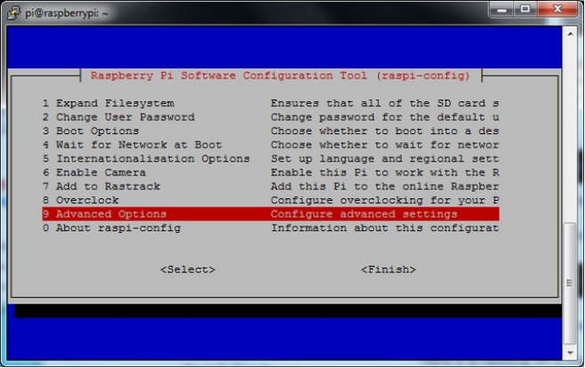
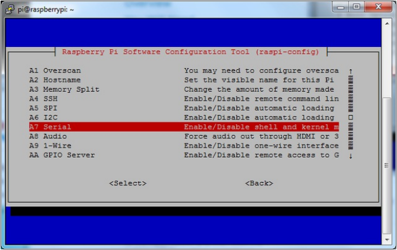
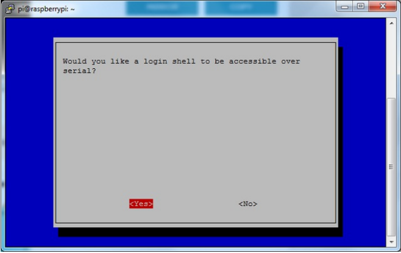
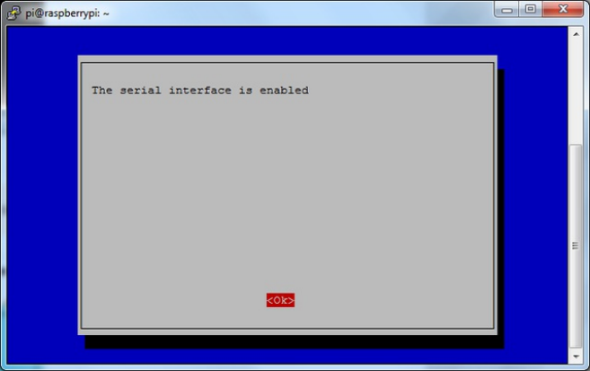
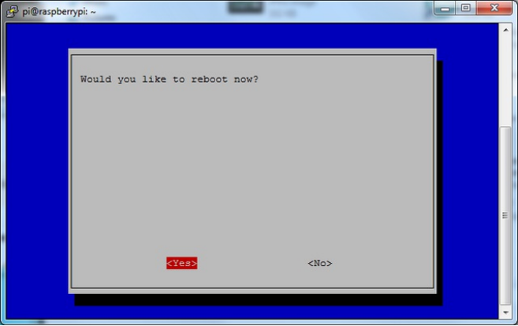

# DiO Controllers

This project uses a Raspberry Pi 3 to send sensor data from an Atlas Scientific Dissolved Oxygen to a remote server. The controller code is written in Python. This setup assumes that you can setup your Raspberry Pi and that you have a basic knowledge of the command line. If you are having trouble getting your Raspberry Pi working, follow the setup instructions in the Raspberry Pi help [documentation](https://www.raspberrypi.org/help/).

## Getting Started

These instructions will get you a copy of the project up and running on your local machine for development and testing purposes. See deployment for notes on how to deploy the project on a live system.

### Prerequisites

Hardware you will need:
- [Raspberry Pi 3](https://www.raspberrypi.org/products/raspberry-pi-3-model-b/)
- At least 8GB [Micro SD card](https://www.amazon.com/s/ref=nb_sb_noss_2?url=search-alias%3Delectronics&field-keywords=micro+sd&rh=n%3A172282%2Ck%3Amicro+sd&ajr=0)
- [Micro USB power supply (2.1 A)](https://www.amazon.com/Raspberry-Keten-Charger-Adapter-Android/dp/B01K7EF2XS/ref=sr_1_cc_2?s=aps&ie=UTF8&qid=1510630813&sr=1-2-catcorr&keywords=micro+usb+power+cable)
- Monitor and HDMI cable (only needed to setup)
- Keyboard and mouse (only needed to setup)
- Atlas Scientific [Dissolved Oxygen sensor kit](https://www.atlas-scientific.com/product_pages/kits/do_kit.html)
- [Jumper wires (female-to-male)](https://www.amazon.com/s/ref=nb_sb_noss_2?url=search-alias%3Dmobile&field-keywords=female+to+male+jumper+wires)
- [USB Wifi adapter](https://www.amazon.com/Edimax-EW-7811Un-150Mbps-Raspberry-Supports/dp/B003MTTJOY)
- [Breadboard](https://www.amazon.com/s/ref=nb_sb_noss_2?url=search-alias%3Delectronics&field-keywords=breadboard&rh=n%3A172282%2Ck%3Abreadboard)

Flash the latest version of [Raspbian](https://www.raspberrypi.org/downloads/) onto the Micro SD card and get your Pi setup by following the [documentation](https://www.raspberrypi.org/help/).

### Software Setup

Once your RP3 is running, connect to your wireless network via the USB adapter or Ethernet cord. Once you are connected to the internet you should download the libraries needed to communicate with the sensor and server. Run the following commands in the terminal.
```
$ sudo apt-get update
$ sudo apt-get install git-core
$ sudo apt-get install python-dev
$ sudo apt-get install python-serial
$ sudo apt-get install python-rpi.gpio
```
By default the serial port on the RP3 is disabled so you will need to manually enable it. To do so run the following commands:
```
$ sudo raspi-config
```
Go to advanced options



Then select Enable/Disable serial



Select Yes



Select Ok



Reboot your RP3



The serial port is now ready to be hooked up!

## Wiring Up the Sensor(s)

[Atlas Scientific Setup Guide](https://www.atlas-scientific.com/_files/code/pi_sample_code.pdf)

## Contributing

Please read [CONTRIBUTING.md](https://gist.github.com/PurpleBooth/b24679402957c63ec426) for details on our code of conduct, and the process for submitting pull requests to us.

## Versioning

We use [SemVer](http://semver.org/) for versioning. For the versions available, see the [tags on this repository](https://github.com/your/project/tags).

## Authors

* **Billie Thompson** - *Initial work* - [PurpleBooth](https://github.com/PurpleBooth)

See also the list of [contributors](https://github.com/your/project/contributors) who participated in this project.

## License

This project is licensed under the MIT License - see the [LICENSE.md](LICENSE.md) file for details

## Acknowledgments

* Hat tip to anyone who's code was used
* Inspiration
* etc
