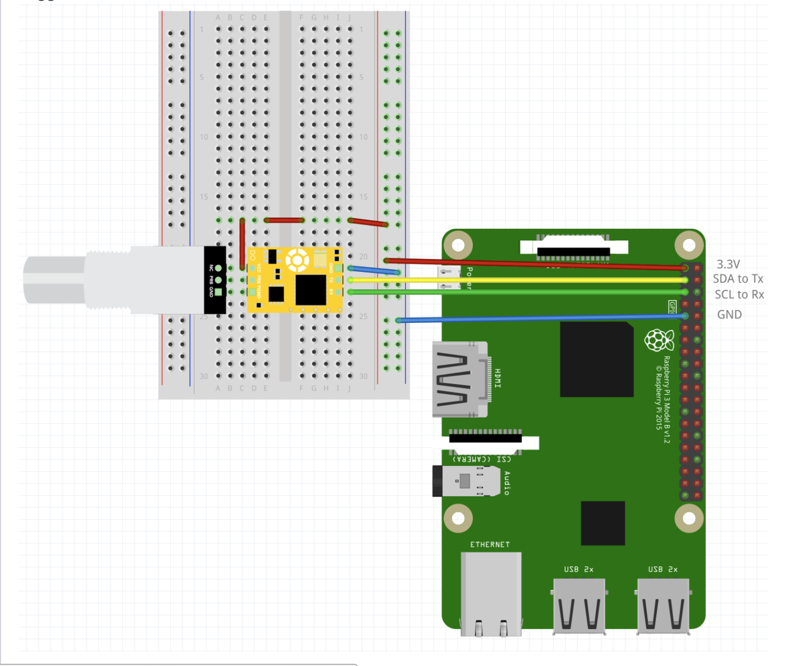

# Volcano Veggies
This project is for a compnay called Volcano Veggies located in Downtown Bend,Oregon. Volcano Veggies is an Aquaponics Vegetable growing farm that can operate all year round and provide fresh local veggies. 
This project is being worked on by two OSU students, Makeila Lundy and Justin Tappert.

This project uses a [Raspberry Pi 3](https://www.raspberrypi.org/products/raspberry-pi-3-model-b/) to send sensor data from an [Atlas Scientific Dissolved Oxygen sensor](https://www.atlas-scientific.com/product_pages/kits/do_kit.html) to a remote server. The controller code is written in Python. This setup assumes that you can setup your Raspberry Pi and that you have a basic knowledge of the command line. 

## Getting Started

These instructions will help you get the sensor controller and sensor up and running. See [dio-service](https://github.com/osu-cascades/dio-service) to get the service running.

### Prerequisites

### Software
- Sublime (or the text editor or your choice)
- Python 
- Tmux

# Hardware
Hardware you will need:

- [Raspberry Pi 3](https://www.raspberrypi.org/products/raspberry-pi-3-model-b/)
- At least 8GB [Micro SD card](https://www.amazon.com/s/ref=nb_sb_noss_2?url=search-alias%3Delectronics&field-keywords=micro+sd&rh=n%3A172282%2Ck%3Amicro+sd&ajr=0)
- [Micro USB power supply (2.1 A)](https://www.amazon.com/Raspberry-Keten-Charger-Adapter-Android/dp/B01K7EF2XS/ref=sr_1_cc_2?s=aps&ie=UTF8&qid=1510630813&sr=1-2-catcorr&keywords=micro+usb+power+cable)
- Monitor and HDMI cable (only needed to setup)
- Keyboard and mouse (only needed to setup)
- Atlas Scientific [Dissolved Oxygen sensor kit](https://www.atlas-scientific.com/product_pages/kits/do_kit.html)
- [Jumper wires (female-to-male & male-to-male)](https://www.amazon.com/s/ref=nb_sb_noss_2?url=search-alias%3Dmobile&field-keywords=female+to+male+jumper+wires)
- [USB Wifi adapter](https://www.amazon.com/Edimax-EW-7811Un-150Mbps-Raspberry-Supports/dp/B003MTTJOY)
- [Breadboard](https://www.amazon.com/s/ref=nb_sb_noss_2?url=search-alias%3Delectronics&field-keywords=breadboard&rh=n%3A172282%2Ck%3Abreadboard)

## Hardware Setup

### Wiring Up the Sensor(s)

## Versioning

We use [SemVer](http://semver.org/) for versioning. For the versions available, see the [tags on this repository](https://github.com/your/project/tags).

## Authors

* **Justin Tappert** - *Initial work* - [GitHub Profile](https://github.com/JWTappert)
* **Makeila Lundy** - *Initial work* - [GitHub Profile](https://github.com/MakeilaLundy)

See also the list of [contributors](https://github.com/your/project/contributors) who participated in this project.

## License

This project is licensed under the MIT License - see the [LICENSE.md](LICENSE.md) file for details
